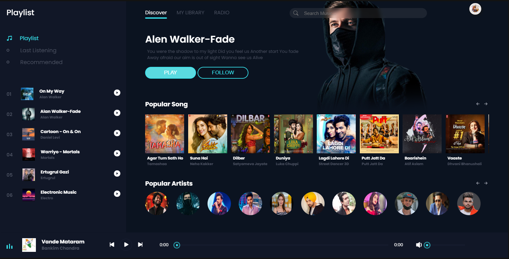

# MP3 Player

A dynamic MP3 player built with JavaScript, HTML, and CSS. This project provides a sleek, user-friendly interface for playing audio files, managing playlists, and controlling playback. It is designed to offer a seamless experience for music lovers and developers looking to integrate audio functionality into their web applications.

## Features

- **Audio Playback Controls**: Play, pause, and stop audio playback.
- **Track Information**: Displays current track details, including title, artist, and duration.
- **Playlist Management**: Add, remove, and reorder tracks in the playlist.
- **Volume Control**: Adjust audio volume with an easy-to-use slider.
- **Seek Bar**: Navigate through the current track using a seek bar.
- **Responsive Design**: Optimized for a variety of screen sizes and devices.
- 
## Screenshot

Here’s a preview of the MP3 Player interface:

  

## Demo

Check out the live demo of the MP3 player:

[](https://yajatmp3.netlify.app/)  

## Installation

To get a local copy of the project up and running, follow these steps:

1. **Clone the repository:**
   ```bash
   git clone https://github.com/yajatwasisht/MP3.git

  ## License
This project is licensed under the MIT License
